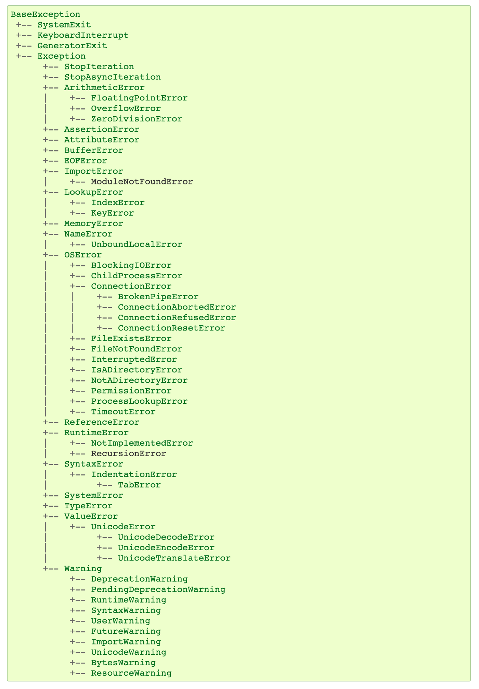

# Exceptions (1/1)
> Thibault Langlois / FCUL / DI / 2022-2023

Uma Exceção é um objeto criado quando um erro ocorre. Este objeto contém informações sobre a natureza do erro e a localização desta ocorrência no código. A natureza do erro está representada pelo tipo de exceção enquanto a localização está armazenada uma estrutura chamada *traceback*.

Muitos tipos de exceções estão pre-definidos em python:



Estão organizadas numa hierarquia de classes onde `Exception` está no topo. Na imagem pode-se ver que `ArithmeticException` é uma subclasse de `Exception` e uma super classe de `ZeroDivisionError`.

Para entender o mecanismo de exceções vamos escrever código com erros.

```python
x = 50
y = 0
print(x / y)
```
```
$ python errors.py
Traceback (most recent call last):
  File "errors.py", line 3, in <module>
    print(x / y)
ZeroDivisionError: division by zero
```

Para poder remediar aos eventuais erros que podem ocorrer numa sequência de instruções, usamos um bloco try:

```python
try:
    x = 50
    y = 0
    print(x / y)
    f = open('inexistent.txt', mode='r')
except Exception as e:
    print('Something is bad: ' + str(e))
```
A um bloco `try` podem estar associados vários blocos `except` de maneira de tratar de maneira diferente cada tipo de erros: 

```python
try:
    x = 50
    y = 0
    print(x / y)
    f = open('inexistent.txt', mode='r')
except FileNotFoundError as e:
    print('O ficheiro não existe ! (' + str(e) + ')')
except ZeroDivisionError as e:
    print('You cannot divide by zero.')
else:
    print('this line is executed if no errors occured.')
    f.close()
finally:
    print('this line is executed in all cases.')
```

O bloco `else` é executado quando nenhum erro ocorreu no bloco `try`. O bloco `finally` é executado em todos os casos (se houve ou não erros ao executar o bloco `try`).

O bloco `finally` deve ser o último. O bloco `else` deve aparecer (opcionalmente) a seguir aos blocos `except`.

A ordem na qual aparecem os blocos `except` é importante. No exemplo seguinte uma exceção de tipo `Exception` é usada antes da exceção `ZeroDivisionError`:

```python
try:
    x = 50
    y = 0
    print(x / y)
    f = open('inexistent.txt', mode='r')
except Exception as e:
    print('Something is bad: ' + str(e))
except ZeroDivisionError as e:
    print('You cannot divide by zero.')
else:
    print('this line is executed if no errors occured.')
    f.close()
finally:
    print('this line is executed in all cases.')
```
```
Something is bad: division by zero
this line is executed in all cases.
```

Como a exceção `Exception` é superclasse de `ZeroDivisionError` tem precedência e o bloco associado à segunda exceção nunca será executado.

> Os blocos `except` devem estar ordenados conforme a hierarquia das classes de exceções, da mais especifica até a mais geral.

## Lançamento de exceções

Até agora vimos situações onde os erros estão detetadas pelo código da biblioteca do python (abertura de ficheiro, operações aritméticas etc..). O programador deve também escrever código que deteta situações anómalas e lançar exceções quando for necessário.

A instrução `raise` é usada para criar e lançar a exceção:

```python
def between(x, min, max):
    if min > max:
        raise ValueError('The value of min must be less than max') 
    return x >= min and y <= max
```

## Onde tratar as exceções ?

Tratar uma exceção significa prever o que se deve fazer quando o problema ocorre. Se um ficheiro está em falta, talvez pode ser criado, talvez pode-se pedir um ficheiro alternativo ao utilizador... Na esmagadora maioria dos casos, não onde (no código) o problema é detetado que o remédio está disponível. 

No caso do ficheiro em falta, conforme a aplicação, a situação existem várias maneiras de remediar o problema. Quem pode decidir é o cliente ou seja o programa que usa o acesso ao sistema de ficheiros.

O mecanismo das exceções, dividido em duas partes 
1. lançamento com a instrução `raise` e
2. tratamento com o bloco `try - except - else - finally` 
tem como objetivo a resolução deste problema.

Quando uma exceção é lançada, a execução normal do programa é interrompida. No exemplo da função `between`, o cliente (o programa que usa esta função) é responsável por tratar a exceção.  

Enquanto o lançamento de uma exceção é efetuado quando o problema é detetado, o seu tratamento é feito no sitio da aplicação onde faz sentido, isto é, onde a informação necessária para remediar ao problema está disponível.

## A instrução `assert` 

A instrução `assert` pode ser usada para lançar de maneira muito simples uma exceção de tipo `AssertionError`.

```python
assert min <= max, 'min should not be greater than max'
```
é equivalente a:
```python
if not min <= max:
    raise AssertionError('min should not be greater than max')
```

## Definir novas exceções

Quando desenvolvemos uma applicação é vantajoso definir exceções próprias ao domínio da aplicação. Por exemplo quando um valor está fora de um certo intervalo de valores aceitaveis pode-se criar uma exceção apropriada (NegativeTempException).

A definição de uma nova exceção resume-se a definição de uma classe subclasse de `Exception`:

```python
class InvalidDateException(Exception):
    "Raised when the value does not correspond to a valid date"
    pass
```

Se for necessário, a classe pode também ter um construtor e atributos:

```python
class SalaryNotInRangeError(Exception):
    """Exception raised for errors in the input salary.

    Attributes:
        salary -- input salary which caused the error
        message -- explanation of the error
    """

    def __init__(self, salary, message="Salary is not in (5000, 15000) range"):
        self.salary = salary
        self.message = message
        super().__init__(self.message)
```

Neste caso, quando esta exceção for usada é necessário passar os valores para o construtor:

```python
salary = int(input("Enter salary amount: "))
if not 5000 < salary < 15000:
    raise SalaryNotInRangeError(salary)
```

## Apanhar e lançar outra vez

Esta situação ocorre com frequencia. O erro é devido a um problema de
«baixo nível» (ex. um ficheiro em falta, um valor errado etc..). Este
tipo de erro pode não dizer respeito ao utilizador final da
aplicação. E neccessário comunicar ao utilizador que algo esta a
correr mal sem usar um vocabulário de «especialista».

Neste tipo situação vamos criar uma classe de xceção muito geral (tipo
ApplicationExcpetion) que servirá a avisar o utilizador:

```python
try:
    # lines of code
except SomeVerySpecificException as e:
    logging.error(str(e))
    raise ApplicationException('Ocorreu um problema, contacte o responsável.')
```

Este mecanismo é particularmente interessante no contexto de uma
interface gráfica porque a exceção `ApplicationException` pode ser
apanhada ao nível do código da interface (camada de apresentação) para
mostrar a mensagem numa janela.
