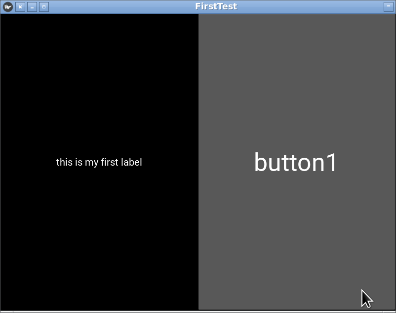
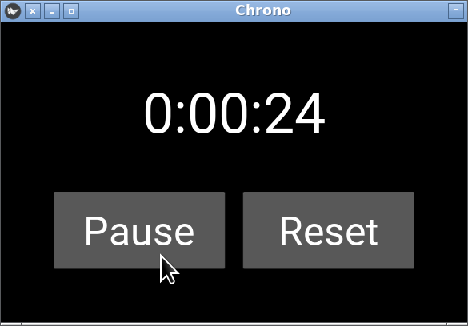
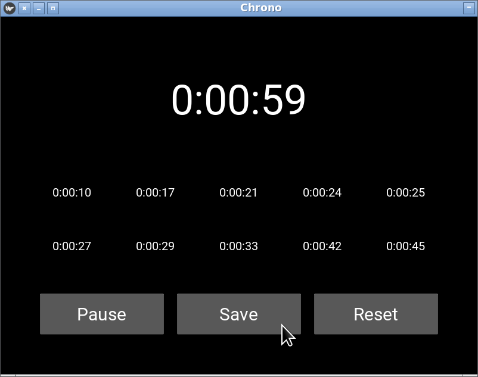
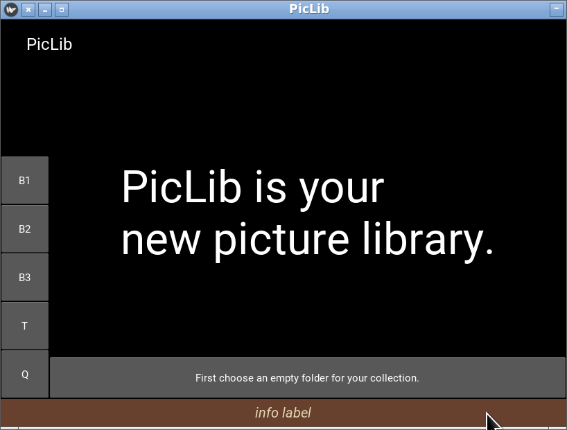
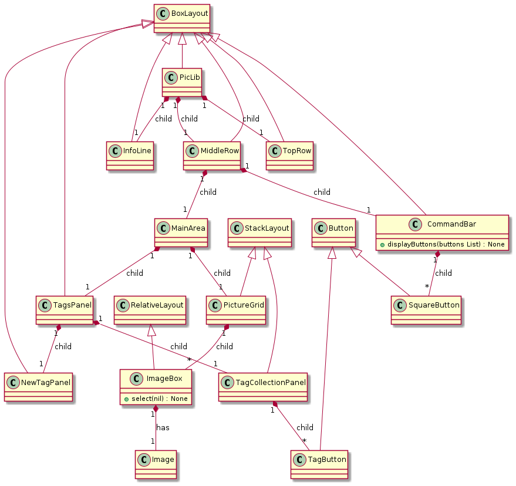

# Interfaces gráficas com Kivy (1/2)
> Thibault Langlois / FCUL / DI /  2021-2023

## Instalação

```
pip install kivy
```

## Testar a instalação

```python
import kivy
# Imports 
from kivy.app import App
from kivy.uix.label import Label
from kivy.uix.button import Button
from kivy.uix.boxlayout import BoxLayout
# import os
# os.environ['KIVY_GL_BACKEND'] = 'angle_sdl2'

# A kivy application is made by sub-classing the App kivy class:
class FirstTest(App):
    
    # We must redefine (override) the build method:
    def build(self):
        # All widgets will be arranged in a BoxLayout:
        box = BoxLayout()
        self.label = Label(text='this is my first label', font_size=20)
        self.button1 = Button(text='button1', font_size=50)
        box.add_widget(self.label)
        box.add_widget(self.button1)
        self.button1.bind(on_press = self.doSomething)
        # we MUST return the main root widget:
        return box

    def doSomething(self,theButton):
        print('button1 was pressed.')

FirstTest().run()
```

Pode obter um erro em windows (kivy fatal error minimum required
opengl version 2.0 not found). Neste caso deve remover os comentários
no exemplo anterior de forma a incluir as linhas:
```python
import os
os.environ['KIVY_GL_BACKEND'] = 'angle_sdl2'
``` 



## Documentação

* Manual on-line onde pode-se pesquisar assuntos: https://kivy.org/doc/stable/
* Versão PDF: https://buildmedia.readthedocs.org/media/pdf/kivy/latest/kivy.pdf (763 páginas)

## Conceitos básicos

### Cores 
As cores são representadas por tuples de 4 elementos que correspondem
a: `(red, green, blue, opacity)` onde cada elemento corresponde a
intensidade (num intervalo [0 .. 1]) das componentes vermelho, verde e
azul da cor mais um índice de opacidade. Se a opacidade for igual a 0
o elemento não será visível. 

### Coordenadas
As coordenadas têm como origem o canto inferior esquerdo.

### Widget
Um widget é um elemento gráfico : botão, label, etc...

### Eventos
Uma aplicação com interface gráfica não funciona como os programas que
fizemos até agora. Quando a aplicação arranca, a biblioteca do Kivy
executa um 'ciclo principal': 
```
[INFO   ] [Base        ] Start application main loop
```  
este ciclo tem como objetivo ficar a espera de 'eventos' e
processa-los a medida que ocorrem. Os eventos são geralmente
provocados pelo utilizador da aplicação através da interface:  

* cliques com os botões do rato
* pressão em teclas 
* scrolling 
* movimentos do rato
* etc...

os eventos estão colocados numa fila (FIFO) e processados pelo
programa. A programação de uma aplicação com Kivy consiste (entre
outros assuntos) em especificar como os eventos em determinados
contextos devem ser processados. Teremos que indicar por exemplo qual
função deve ser executada quando um certo botão é premido.

O Kivy trata da gestão da fila de eventos. 

### Layouts (paginação)

Os *widgets* estão colocados na janela da aplicação recorrendo a um
objeto de tipo '*layout*' responsável pela paginação, a disposição dos
vários *widgets* que o compõem. Um elemento de um *layout* pode ser um
*layout* definido uma estrutura hierárquica (uma árvore) que define o
tamanho e a posição de todos os elementos da interface gráfica. 

### Object Orientation

Toda a biblioteca Kivy está assenta numa abordagem Orientada
Objeto. Tantos os *widgets* como os *layouts* são classes. Cada vez
que é necessário adaptar um widget ou um layout para uma aplicação, é
feito definindo uma subclasse.

### KV language
É possível especificar o aspeto da interface gráfica usando uma
linguagem declarativa ad-hoc chamada **kv language**. Segue-se um
exemplo de ficheiro que define uma interface gráfica (excerto): 
```
<MyLayout>
    canvas.before:
        Color: 
            rgba: (1,1,1,1)
        Rectangle:
            pos: self.pos
            size: self.size

    BoxLayout:
        orientation: 'vertical'
        size: root.width, root.height
        spacing: 10
        padding: 10

        Image:
            source: 'myimage.png'
            allow_stretch: True
            keep_ratio: True
```

**Não vamos seguir esta abordagem**. Vamos definir as interfaces
usando apenas a programação em Python. 

## Layouts
O Kivy disponibiliza vários layouts:

* `BoxLayout`: os elementos estão organizados numa linha ou numa coluna
* `Gridlayout` : os elementos estão colocados numa grelha.
* `StackLayout` : os elementos estão ordenados segundo uma
direção. Por exemplo, a ordem `'lr-tb'` (da esquerda para a direita e
de cima para baixo) vai colocar os elementos primeiro numa linha. Se
os elementos não couberem numa linha, ua segunda linha é criada a
semelhança da colocação das palavras num texto.
* `FloatLayout` : permite colocar os elementos em posições arbitrárias
* `RelativeLayout` : idem mas as coordenadas são relativas ao próprio layout.
* etc...

O esquema geral consiste em :

1. criar uma instância de layout ex.:
```python
box = BoxLayout()
```
2. atribuir-lhe as características desejadas ex.:
```python
box.spacing = 5
box.padding = 10
```
Algumas características podem ser inicializadas na criação do objeto,
quando o construtor é chamado. 

3. adicionar widgets ex.:
```python
box.add_widget(Button(text='button 1'))
``` 

## Chrono app example

Este exemplo de aplicação é um cronógrafo:


A janela está dividida em duas partes, verticalmente: 

1. um label que mostra o tempo decorrido
2. uma linha composta de dois botões

Esta paginação pode ser obtida com dois *layouts*: um `BoxLayout`
vertical que contem  duas «linhas» : 
* a primeira linha contém o label
* a segunda contém um `BoxLayout` horizontal composto de dois botões.

```python
# A kivy application is made by sub-classing the App kivy class:
class Chrono(App):
    # We must redefine (override) the build method:
    def build(self):
        # the start attribute is used to display the elapsed time: 
        self.start = datetime.now()
        # All widgets will be arranged in a vertical BoxLayout:
        box = BoxLayout(orientation='vertical', padding=50, spacing=20)
        # The row of buttons is also a BoxLayout:
        buttonRow = BoxLayout(orientation='horizontal',spacing=20,padding=15)
        # A label is used to display the time:
        self.label = Label(text=self.getTime(), font_size=70, color=(1,1,1,1))
        # The first button is for Start/Pause/Resume the chronograph
        self.button1 = Button(text='Start', font_size=50)
        # The second button is for resetting the chronograph
        self.button2 = Button(text='Reset', font_size=50)
        # Add widgets to layouts:
        box.add_widget(self.label)
        buttonRow.add_widget(self.button1)
        buttonRow.add_widget(self.button2)
        box.add_widget(buttonRow)
```
Para funcionar precisamos de indicar os métodos que devem ser
 executados quando o utilizador clica nos botões:
```python
        # Set the methods that will be called when buttons are pressed:
        self.button1.bind(on_press = self.startPausePressed)
        self.button2.bind(on_press = self.resetPressed)
        # Define an attribute that will hold a periodic event for the chronograph
        self.chronoEvent = None
        # the clock attribute is useful for pause/resume operations
        self.clock = 0
        # we MUST return the main root widget:
        return box
```
Três atributos são usados:
* `start` regista a data/hora de início i.e. por exemplo quando o
  utilizador carrega no botão 'Start'. 
* `clock` é usado para memorizar a data/hora quando o botão 'Pause' é carregado.
* `chronoEvent` contém um objeto do tipo «event» que vai correr
  periodicamente uma função que atualiza o cronógrafo. 

Finalmente temos que adicionar à classe os métodos que processam os eventos. O caso do botão 'Reset' é bastante simples:
```python
    def resetPressed(self, b):
        """
        resetPressed is called when the reset button is pressed.
        It resets the chronograph.
        """
        self.start = datetime.now()
```
O botão 'Start' vai ter um papel múltiplo. A primeira vez que é
pressionado, o cronógrafo arranca e o texto do botão é alterado para
'Pause'. Se o utilizador premir o botão 'Pause' o cronógrafo pará e o
texto associado ao botão passa a ser 'Resume'. Quando o utilizador
carregar em 'Resume' o cronógrafo continua a contar o tempo desde o
momento onde parou e passa a mostrar 'Pause'.

```python
    def startPausePressed(self, b):
        """
        startPausePressed is called when the Start/Pause/Resume 
        button is pressed.
        The button text is used to select the action to be done. 
        The button label is updated accordingly.
        """
        if self.button1.text == 'Start':
            self.start = datetime.now()
            self.chronoEvent = Clock.schedule_interval(self.setTimeValue, 1.0/2.0)
            self.button1.text = 'Pause'
        elif self.button1.text == 'Pause':
            self.clock = datetime.now()            
            self.chronoEvent.cancel()
            self.button1.text = 'Resume'
        elif self.button1.text == 'Resume':
            self.start = datetime.now() - self.clock + self.start 
            self.chronoEvent = Clock.schedule_interval(self.setTimeValue, 1.0/100)
            self.button1.text = 'Pause'
```

Dois métodos auxiliares completam a implementação:

```python
    def getTime(self):
        """
        getTime: returns the elapsed time since start.

        Returns:
            [string]: a time amount following the format 'HH:MM:SS'
        """
        t = datetime.now() - self.start
        return str(t)[:-7]

    def setTimeValue(self, x):
        """
        setTimeValue Updates the label with elapsed time. This function 
        is called periodically.
        """
        self.label.text = self.getTime()
```

## Controlar a posição e o tamanho dos elementos

Se experimentamos alterar o tamanho da janela da aplicação «chrono» o
resultado pode surpreender. Por omissão, os widgets ocupam todo o
espaço disponível. Conseguir obter exatamente o aspeto e comportamento
desejado pode ser complicado. O primeiro passo consiste em usar o
layout adaptado ao problema. Para isso é necessário **ler a
documentação**.

O exemplo anterior pode ser melhorado de forma a que o tamanho dos
botões não cresce verticalmente quando a janela é ampliada. Para isso
é necessário 'desligar' o cáculo automático da altura do layout que
contém esses botões e indicar a altura desejada:

```python
buttonRow.size_hint_y = None
buttonRow.height = 100
```
É possível indicar o tamanho mínimo que desejamos que um layout
tenha. Por exemplo podemos indicar que o layout principal não tenha
uma largura inferior a 500 pixeis:

```python
self.box.size_hint_min_x = 500
```
Este valor vai restringir o tamanho do layout mas não o da janela.

## Exercício: extender a aplicação
Cada vez que o utilizador pressione o botão save, a aplicação memoriza
o tempo intermédio e continua a contar. Pode memorizar até 10 valores
que são mostradas numa grelha:


 
## Layout para PicLib



> Uma abordagem orientada objetos e iterativa

Cada elemento da interface corresponde a uma classe. Os objetos
(widgets) estão organizados numa hierarquia. 


