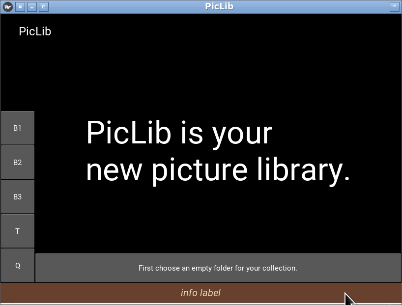
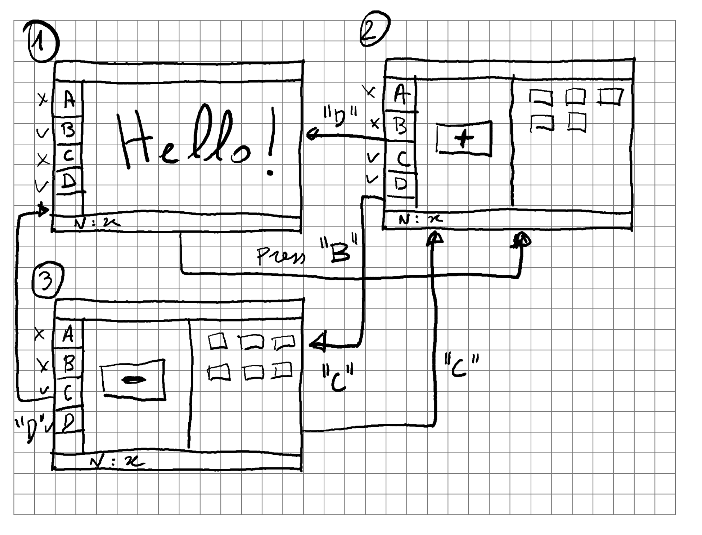

# Interfaces gráficas com Kivy (2/2)
> Thibault Langlois / FCUL / DI /  2021-2023

## Hieraquias
Para além das relações de herança que formam uma hierarquia, existe no
contexto de uma interface gráfica desenvolvida com Kivy uma hierarquia
de widgets que determina a organização espacial das várias componentes
da interface.

Nesta hierarquia existem dois tipos de objetos:

* widgets: componentes gráficas da interface
* layouts: contentores de widgets e layouts (dái a estrutura
  hierárquica) esses objetos têm como papel determinar a posição e o
  tamanho dos seus elementos.

Os objetos de tipo layout têm um métodos e atributos para construir,
alterar e consultar a hierarquia de widgets:

* `add_widget(w)` é o método que permite adicionar um widget a um layout
* `remove_widget(w)` é o método que permite remover um widget
* `children` este atributo é uma lista que contém os widgets «filhos»
  de um layout. Não deve ser modificado diretamente.
* `parent` é um atributo que todos os widgets possuem que contém o
  widget «pai». Não deve ser modificado. É útil para aceder aos
  métodos associados ao widget/layout do objeto pai.
* `clear_widgets()` é um método que remove todos os elementos de um layout.

Os widgets não estão destruídos quando removidos do seu layout. Apenas
deixam de estar visíveis. É vantajoso (mais simples) na maioria dos
casos, criar os widgets uma vez e os mostrar/esconder durante a
execução do programa. Para conseguir isso é necessário conservar os
widgets em atributos da classe.

## Exemplo
Para ilustrar vamos considerar uma aplicação hipotética cuja interface é :

 

Nesta interface temos três componentes arranjados verticalmente:

1. a linha de cima com o nome da aplicação
2. a linha de baixo com a cor castanha
3. a zona principal no meio.

Por sua vez a zona principal tem dois paneis arranjados horizontalmente: 

1. uma barra vertical a esquerda que mostra botões quadrados 
2. um panel central cujo conteúdo será dinâmico.

A hierarquia de widgets é:

```
MyApp--+---TopRow+---Label1
       |
       +---MainPanel+---ButtonsBar
       |            |
       |            +---CentralPanel
       +---BottomRow+---Label2
```

## Interface Dinâmica
Queremos que a interface gráfica seja adaptada a cada situação no decorrer da aplicação.
Imaginemos que existe um botão «Settings» que permite configurara a
aplicação. Quando o botão é pressionado o CentralPanel deve passar a
mostrar um widget que contém todos os elementos que permitem alterar a
configuração. Mas não é a única atividade a decorrer no
CentralPanel. Este Panel deve ser capaz mostrar vários elementos
conforme a situação.

Para cumprir este objetivo o PanelCentral será organizado da seguinte forma: 
```
CentralPanel+---ConfigPanel
            |
            +---Task1Panel
            |
            +---Task2Panel
            |
            +--- etc...
```

> Cada panel nas duas árvores anteriores correspondem a uma classe, sub-classe de um layout, definida num modulo separado.

O esboço do construtor da classe `CentralPanel` pode ser algo assim:

```python
class CentralPanel(BoxLayout):
    def __init__(self, **kwargs):
        self.configPanel = ConfigPanel()
        self.task1Panel = Task1Panel()
        self.task2Panel = Task2Panel()
        self.add_widget(self.task1Panel)
```
Os elementos do `CentralPanel` estão criados pelo construtor mas
apenas um é mostrado inicialmente (`task1Panel`). A classe vai
disponibilizar métodos para alternar os paneis:

```python
    def showConfigPanel(self):
        self.clear_widgets()
        self.add_widget(self.configPanel)

    def showTask1Panel(self):
        # ...

    def showTask2Panel(self):
        # ... 
```

## Abordagem OO
As interfaces gráficas são um terreno muito favorável à programação
orientada objetos. Uma das primeiras linguagens deste paradigma de
programação foi o smalltalk-78 cujo ambiente gráfico foi também um dos
primeiros.

https://youtu.be/JLPiMl8XUKU?t=91

Nesta linguagem os objetos trocam «mensagens». Nas linguagens modernas
a troca de mensagem corresponde a chamada de métodos. Se um método `m`
do objeto `a1` precisar que o objeto `a2` faça alguma tarefa `f`,
usas-se em `m` : `x = a2.f()`. 

A abordagem OO no contexto das interfaces gráficas permite dividir as
responsabilidades entre as várias componentes. Por exemplo o objeto
`ButtonsBar` será responsável pelo posicionamento, aspeto e
comportamento dos botões que o compõem. Fora desta classe esses
pormenores serão ignorados. 

O objeto `MainPanel` contém o `ButtonsBar` e  o `CentralPanel`. Será
ele o responsável para a posicionamento desses elementos. Por exemplo
se queremos que seja possível mudar a barra de botões para o lado
direito o método responsável por esta mudança será definido na classe
`MainPanel`. 

O problema que surge agora é: como por os vários objetos a fala entre si ?

## Ligações entre componentes

Imaginemos a situação seguinte: no contexto do `Task1Panel` um certo
número de items são selecionados. Queremos que este valor aparece no
elemento `BottomRow`. 

Para conseguir este objetivo:

1. o objeto `Task1Panel` deve estar a par da existência do objeto `BottomRow`.
2. o objeto `BottomRow` deve possuir um método que altere a interface.

O segundo ponto é simples. Basta, na classe `BottomRow`, definir um
método `displayNumItems` :

```python
    def displayNumItems(self, n):
        self.label2.text = 'Num of items: ' + str(n) 
```

Para conseguir podemos inicializar um atributo com uma referência para
o objeto `BottomRow` na classe `Task1Panel`. Pode ser feito no
construtor:

```python
class Task1Panel(BoxLayout):
    def __init__(self, bottomRow, **kwargs):
        self.bottomRow = bottomRow
```

Uma vez que a referência para o elemento `BottomRow` está disponível,
basta chamar o método pretendido no método da classe `Task1Panel`:

```python
   def findItems(self):
       items = # ... 
       self.bottomRow.displayNumItems(len(items))
```

Se houver ligações entre muitos componentes esta abordagem implica que
os construtores tenham muitos parâmetros. Pode igualmente ser
necessário passar o elemento ao qual precisamos de ter acesso ao longo
da hierarquia de layouts.
```
MyApp--+---TopRow+---Label1
       |
       +---MainPanel+---ButtonsBar
       |            |
       |            +---CentralPanel+---ConfigPanel
       |                            |
       |                            +---Task1Panel
       |                            |
       |                            +---Task2Panel
       |                            |
       |                            +--- etc...
       +---BottomRow+---Label2
```
Neste exemplo o objeto `BottomRow` tem de ser passado pelos
construtores de `MainPanel`, `CentralPanel` para finalmente chegar ao
`Task1Panel`.

Uma alternativa consiste em usar o widget de raiz (`MyAppLayout`) como
um *hub* que tem acesso a todos os componentes da interface
necessários. Para isso é necessário: 

* definir *getters* na classe,
* inicializar os objetos de forma que tenham uma referência para o
  objeto `MyAppLayout`: 

```python
class MayAppLayout(BoxLayout):
    def __init__(self, **kwargs):
        # ...
        self.topRow = TopRow()
        self.mainPanel = MainPanel(self)
        self.bottomRow = BottomRow()

    def getBottomRow(self):
        return self.bottomRow

    # mais getters se necessário...

class MyApp(App):
    def build(self):
        return MyAppLayout()

if __name__ == '__main__':
    MyApp().run()

```
Passar `self` como parâmetro do construtor permite inicializar um
atributo na classe `MainPanel` ou numa classe mais abaixo na
hierarquia com uma referência para o widget de topo.

Seguindo o exemplo anterior, a classe `Task1Panel` tem um atributo com
a referência do widget de topo e o método `findItems` fica:
```python
   def findItems(self):
       items = # ... 
       self.topWidget.getBottomRow().displayNumItems(len(items))
```

## Call (me) back

Imaginemos agora que o `Task2Panel` tem como papel permitir selecionar
um conjunto de itens. A seleção está concluída quando o utilizador
carrega no botão 'OK'.

Esta seleção pode ser feita com vários objetivos (colocar os items no
cesto, guardar numa lista de compras etc...). A ação que deve ser
executada quando o utilizador terminar a sua seleção (e clicar no
'OK') vai depender dos casos.

Para variar o comportamento associado ao botão pode-se passar uma
função que será associada ao botão:

```python
    # Mostar o Task2Panel. O método `fnOK` será associado 
    # ao botão 'OK' 
    parent.showTask2Panel(self.fnOK)  
```

```python
    def showTask2Panel(self, fn):
        self.clear_widgets()
        self.okButton.on_release = fn
        self.topWidget.getButtonsBar().setButtons(... self.okButton ...)
        self.add_widget(self.task2Panel)
```


## Exercício

Definir uma interface semelhante à anterior com o comportamento descrito a seguir. 

 

Inicialmente a aplicação mostra o ecrã (1). No panel central é
mostrado um Label. No panel `ButtonsBar` aparecem quatro botões A, B,
C e D. Apenas os botões B e D são ativos.

> para tornar um botão ativo deve usar o atributo `disabled` (cujo valor é `False` por omissão) ou caso use a classe `SquareButton` (fornecida abaixo), o método `enable()` e para o desativar, o método `disable()`.

No panel `TopRow` aparece um label «MyApp». O panel `BottomRow` mostra o label «N: --».

O botão D termina o programa. O botão B passa para a configuração (2)
onde o panel central mostra dois widgets : 

* a esquerda: um botão «+»
* a direita uma grelha de labels

Cada vez que o utilizador pressiona o botão, um label é adicionado na
parte direita. O número de labels criados aparece no panel
`BottomRow`. Quando o utilizador pressione o botão D, volta ao ecrã
inicial (1). Quando pressiona o botão C passa a configuração (3). 

Na configuração (3) o botão «+» é substituído por «-» e a ação
desencadeada remove um do labels do panel a direita. O botão D permite
voltar ao ecrã inicial enquanto o botão C passa para a configuração
(2). 

Numa primeira fase não deve dedicar esforço ao aspeto estético da
aplicação. Uma vez que obteve o comportamento desejado, pode passar ao
aspeto estético. Esta segunda fase vai permitir entender melhor os
mecanismos que devem ser usados para controlar  tamanho e a posição do
widgets.

```python
class SquareButton(Button):
    def __init__(self, **kwargs):
        super().__init__(**kwargs)
        self.name = self.text
        self.color = (1,1,1,1)
        self.bold = True
        self.height = 70
        self.size_hint_y = None
        self.width = 70
        self.size_hint_x = None
        self.disabled = False

    def disable(self):
        self.disabled = True

    def enable(self):
        self.disabled = False

    def __str__(self):
        return 'SquareButton-' + self.text
```


