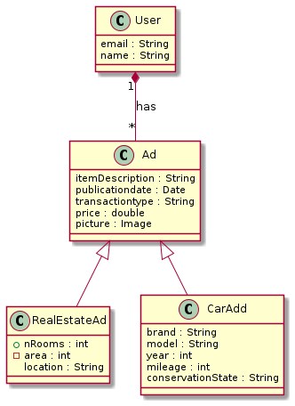
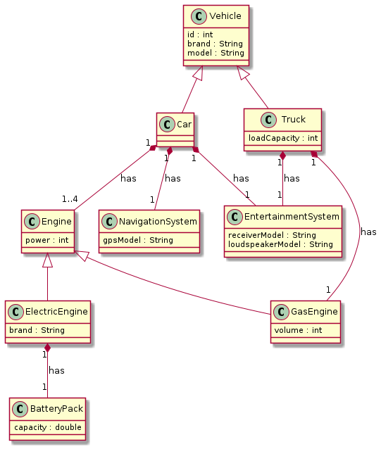

# Programação Orientada Objetos (3/3)
> Thibault Langlois / FCUL / DI /  2021

---
## Atributos e Métodos pré-definidos

### `__mro__` , `mro()`
MRO = Method Resolution Order.

O método `mro()` retorna um lista de super-classes que define a ordem de procura dos métodos. `__mro__` é um atributo que contém a mesma informação num tuple:

```python
print(B.__mro__)
print(B.mro())
```
vai produzir: 
```
(<class '__main__.B'>, <class '__main__.A1'>, <class '__main__.A2'>, <class 'object'>)
[<class '__main__.B'>, <class '__main__.A1'>, <class '__main__.A2'>, <class 'object'>]
```

### `__str__()`
O método `__str__()` está definido na classe `object` (a super-classe de todas as classes) e retorna a instância sob forma de uma cadeia de caracteres:

```python
print(s3.__str__()) 
```
produz:
```
<__main__.Student object at 0x7f0fe5f4dd60>
```
A representação retornada pelo método não é muito útil. Muitas vezes o método é redefinido. Por exemplo:

```python
def __str__(self):
    return self.name + ' ' + self.number
```

### `__dict__`
`___dict___` é um atributo que contém um dicionário com os valores dos atributos da instância.
```python
print(s3.__dict__)
```
produz:
```
{'number': 34343, 'name': 'Anatolio Picota', 'courses': ['PPO', 'FP', 'CP']}
``` 

---
## @staticmethod

```python
class A():

    z = 33

    def m1(self, x):
        print('Running m1 '+str(self)+',' + str(x) + ',' + 
        str(self.z))

    @classmethod
    def m2(cls, x):
        print('Running m2('+str(cls)+ ',' + str(x) + ') ' + 
        str(cls.z)) 

    @staticmethod
    def m3(x):
        # print('Running m3('+ str(x) + ') ' + str(z))    
        print('Running m3('+ str(x) + ')')
```

Um método static (com a decoração `@staticmethod`) é independente dos outros elementos da classe. Depende apenas dos seus parâmetros, não pode aceder aos atributos de classe (ou de instância).

---
## Classes abstratas

Uma classe pode definir um conjunto de métodos que não têm implementação. Esses métodos são chamados métodos **abstratos** por oposição aos métodos com implementação, os métodos **concretos**.

```python
def myAbstractMethod():
    raise NotImplementedError('some message')
```

> Se uma classe tiver métodos abstratos, é chamada **classe abstrata**. 

> Geralmente não se cria instâncias de classes abstratas, pois existem métodos que não podem ser usados. 

Qual é o uso de uma classe que não tem métodos concretos ?

Pode ser util para especificar um conjunto de operações que um conjunto de classes devem ter. Por exemplo, num programa que permite fazer diagramas coloridos (ver exercício), A classe `Shape` pode ser uma classe abstrata. Definirá um conjunto de métodos abstratos ex.: `draw`, `move`, `scale`, etc... que não têm definição para uma classe `Shape` que é demasiado geral (genérica) para poder conter instruções para esses métodos. 

> O papel de uma classe abstrata é servir de super-classe para outras classe que pode vir a ser definidas no futuro.

Continuando com mesmo exemplo, as classes `Rectangle` ou `Oval` são classes concretas sub-classes de `Shape`. Vão fornecer métodos que substituem os métodos abstratos da super-classe.

Se alguém no futuro desenvolve uma classe `Triangle` para adicionar uma nova funcionalidade à aplicação, esquece fornecer um método `draw` como especificado na classe `Shape`, o programa lançará uma exceção dado que é o método (abstrato) da super-classe que será executado.


---
## UML
UML significa Universal Modeling Language. É uma notação gráfica para representar sistemas de software. Entre outros elementos permite representar classes e relações entre classes. A notação não implica o uso de uma linguagem de programação em particular.

O objetivo desta secção é dar uma introdução a esta notação, limitando à exposição dos conceito Orientados Objetos das aulas anteriores. Para uma referência mais completa, podem ir à ~~Biblioteca~~ Internet.

Uma classe é representada por uma caixa dividida em vários compartimentos arranjados numa coluna. Na primeira linha aparece **o nome da classe**. No segundo, os **atributos** com os seus tipos e visibilidade (ao contrário de linguagem como o Java, o Python não permite esconder verdadeiramente os elementos de uma classe, esta parte será portanto omitida nos exemplos).

A seguir vem o conjunto dos **métodos**. Associado a cada método está o seu nome, a **lista dos parâmetros** com os seu tipos e caso faça sentido o tipo de retorno do método.

As classes não são representadas isoladamente, aparece no diagrama as **relações entre classes**. Os dois tipos de relação mais usadas são as relações de **herança** e de **composição**. As diferentes relações são representadas com setas diferentes. Cardinalidades podem estar associadas ás relações de composição.






