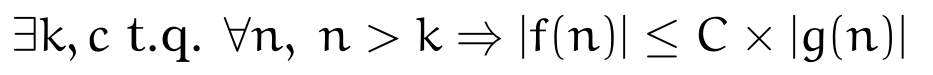

# Complexidade (1/1)
> Thibault Langlois / FCUL / DI /  2021-2023

A complexidade é o estudo da eficiência dos programas. A eficiência
pode estar relacionada com o *tempo de calculo* ou o *espaço ocupado*
em memória pelo programa.

A eficiência de um programa pode fazer parte dos requisitos essências
e ser considerada como fazendo parte da *correção do programa*.
Por exemplo:

* aplicações em tempo real (tráfego aero)
* aplicações financeiras (trading de alta frequência)
* número de transações por segundos (com uma BD)
* rapidez de execução de uma aplicação que interage com o utilizador.

Para além do tempo de computação e do espaço ocupado em memória, a
quantidade de energia consumida e o custo financeiros são fatores que
temos de ter em conta na avaliação de um sistema de software.

## Complexidade computacional

Exemplo:
```python
def linearSearch(l, x):
    """
	Procura o valor x no iterável l. Se x estiver presente
    retorna True. Caso contrário retorna False.
	"""
    result = False
    i = 0
    while i < len(l) and not result:
        if l[i] == x:
            result = True
        i = i + 1
    return result
```

O algoritmo está correto mas quanto tempo demora ? Para responder à
pergunta podemos simplesmente medir o tempo de cálculo.
O problema desta abordagem é que vai depender :

* do tipo de computador usado,
* da eficiência da implementação do python
* do tamanho da lista

Para ter uma ideia mais objetiva podemos:

* calcular o número de passos de computação executados até a conclusão
  do programa.
* estabelecer uma relação entre este valor e a quantidade de dados que
  deve ser processada. Neste exemplo, corresponde ao número de
  elementos da lista.

Geralmente quando se analisa o desempenho de uma função, vários
cenários podem ser considerados:

* o melhor caso (*best case*): corresponde ao caso mais favorável:

```python 
lst = range(500000)
linearSearch(0, lst) # o elemento procurado é o primeiro na lista
```

* o caso médio (*average case*) vai depender do conhecimento a priori
  que temos dos dados (distribuição).
  
* o pior caso (*worst case*). No exemplo anterior corresponde ao caso
  onde o elemento procurado não existe, sendo necessário analisar toda
  lista.
  
Podemos contar o número de passos de computação:

```python
def linearSearch(l, x):
    """
	Procura o valor x no iterável l. Se x estiver presente
    retorna True. Caso contrário retorna False.
	"""
    result = False                   # 1 passo
    i = 0                            # 1 passo
    while i < len(l) and not result: # 4 passos \
        if l[i] == x:                # 1 passo  |
            result = True            #          | × len(l)
        i = i + 1                    # 2 passos /
    return result                    # 1 passo
```
> estamos a considerar que len() conta para um passo.

O número de passos é: 4 + 7 × len(l)

> porquê 4 ?

Quando a lista for comprida, a constante 4 é desprezível. Qualquer
melhoria no fator multiplicativo (7) é relevante.

Outro exemplo:

```python
def f(x):
    """
    Assume x is an int > 0
	"""
    ans = 0
    # Loop that takes constant time
    for i in range(1000):
        ans += 1  # ----------> termo constante
    print('Number of additions so far', ans)
    # Loop that takes time x
    for i in range(x):
        ans += 1 # -----------> termo linear
    print('Number of additions so far', ans)
    # Nested loops take time x**2
    for i in range(x):
        for j in range(x):
            ans += 1 # -------> termo quadrático
            ans += 1 # -------> termo quadrático
    print('Number of additions so far', ans)
    return ans
```

O tempo de computação em função do x é: t(x) = 1000 + 1 × x + 2 × x². Para valores grandes de x, os termos constantes e lineares podem ser desprezados.

## A notação O-grande 

O objetivo é comparar o tempo que demora (ou a memória que ocupa) 
um dado algoritmo a resolver problemas progressivamente maiores, com o 
crescimento de certas funções (por exemplo f(n) = n, f(n) = n³, f(n) = e^n...)

* Sejam duas funções f e g :  N -> R
> a função g domina assimptoticamente f se e só se:

 
                                            
Isto é, existe um par de constantes k e c tais que a partir de um certo valor de n > k, g é sempre maior que f.
Desta maneira podemos determinar o crescimento máximo de f.

> A **classe de complexidade** O(g) representa um conjunto de funções limitadas por g. Neste caso vamos dizer que «f é O(g)» ou que «f é de ordem g» ou que «f é elemento de O(g)».

Exemplos: 

|f() |O() |
|----|----|
1000000 | O(1)
4 × n   | O(n)
10 / n  | O(1/n)
5 × x²  | O(x²)
5 × x³  | O(x³)
5 × x²  | não é O(x)
50000 × x⁴ + 4 x² | O(x⁴)
n² × log(n) | O(n²×log(n) )

## Significado das varias classes de complexidade

| Complexidade| significado |
|-------------|-------------|
| O(1)      | significa tempo de execução constante
| O(log n)  | significa tempo de execução logarítmico
| O(n)      | significa tempo de execução linear
| O(n log n)| significa tempo de execução log-linear
| O(n^c)    | significa tempo de execução polinomial (c é uma constante)
| O(c^n)    | significa tempo de execução exponencial (c é uma constante elevada a uma potência baseada no tamanho do input)

## Propriedades

Seja F de ordem O(f) e G de ordem O(g)

Regras para calcular a complexidade assintótica de uma função:

1. Se o tempo de execução é a soma de vários termos, fique com aquele
que apresenta a maior taxa de crescimento e descarte os restantes termos.

2. Se o termo assim obtido for um produto, descarte as constantes

## Comparação de dois algoritmos 
Para comparar algoritmos que pertencem à mesma classe de complexidade, a função de crescimento deve ser escrita com mais detalhes:
> f(n) = n² + n × log(n) cresce mais rapidamente que g(n) = n² + n

Uma constante pode ser relevante nesta **comparação**: 
> f(n) = a × n² > g(n) = b × n² se a > b


## Complexidade das operações Python

* Listas l, onde n = len(l)

    - Comprimento, len(l): O(1)
    - Acesso indexado, l[4]: O(1)
    - Alteração indexada, l[7] = 4: O(1)
    - Concatenação, l.append(4): O(1)
    - Fatiamento, l[:k]: O(k)
    - Membro?, 4 in l: O(n)
    - Cópia, list(x): O(len(x))
    - Apagar, del l[4], O(n)
    - min, max: O(n)
    - Inserção, l.insert(4, 234): O(n)
    - Ordenação, sorted(l), O(n * log n)
    - Produto, l * k, O(n * k)

* Conjuntos s, t, onde n = len(s) e m = len(t)

    - Comprimento, len(l): O(1)
    - Membro?, 4 in l: O(1)
    - Uniao, s | t: O( n + m)
    - Interseção, s & t: O( n * m)
    - Diferença, s - t: O(n)
    - Cópia, set(x): O(len(x))

* Dicionários d onde n = len(d)
    - Membro?, 4 in d: O(1)
    - Acesso, chave in d, O(1)
    - Alteração, d[chave] = 4: O(1)
    - Apagar, del d[chave], O(1)
    - Cópia, dict(d): O(n)

